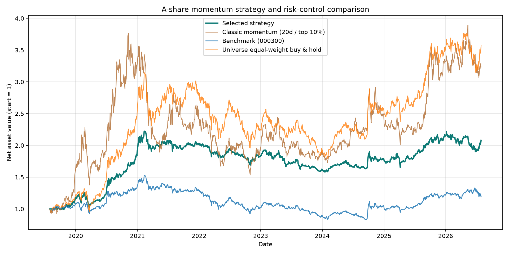

# A-Share Momentum Risk-Control Research

[](https://www.python.org/)
[](tests/)
[](LICENSE)

A reproducible research project on cross-sectional momentum and risk budgeting in a fixed sample of 20 mainland Chinese A-shares. The project keeps the original 20-trading-day / top-10% momentum rule as a fixed comparator, then asks whether diversification, volatility targeting, and a market-trend exposure cap can produce a less fragile historical profile without leverage. The implemented signal-to-execution protocol is chronological; the fixed current-stock sample nevertheless remains subject to survivorship and selection bias.

The answer in the frozen sample is a trade-off, not a claim of an optimal strategy: the risk-controlled portfolio exhibited a **-28.99%** maximum drawdown versus **-59.23%** for the fixed original comparator, while annualized return fell from **18.23% to 11.02%**. Same-universe equal-weight buy-and-hold still had the strongest annualized return (**19.93%**) and Sharpe ratio (**0.84**).

> Academic research and educational software only. The historical results are affected by material biases and are not investment advice.

## Research design

The default risk-controlled portfolio combines:

- a 70% monthly rebalanced equal-weight core;
- a 30% satellite selecting the top 30% by trailing 120-trading-day return;
- an 18% annualized volatility target estimated from up to 60 prior portfolio returns, used only to reduce exposure;
- a 50% equity cap when the CSI 300 closes below its trailing 200-day average;
- zero-return cash for unused risk budget, no shorting, and no leverage; and
- a simplified 10-basis-point cost applied to absolute traded notional on both buys and sells.

Signals use information available through a month-end close. New targets execute at the next trading-day close, after that day's return has accrued to the old holdings. The fixed classic comparator always uses a 20-day lookback and top-10% selection.

## Frozen historical results

Common comparison window: **2019-08-01 to 2026-07-30** (1,696 trading days).

| Portfolio | Annualized return | Annualized volatility | Maximum drawdown | Sharpe (rf = 0) |
| --- | ---: | ---: | ---: | ---: |
| Risk-controlled core/satellite | 11.02% | 15.67% | -28.99% | 0.75 |
| Classic momentum (20 days / top 10%) | 18.23% | 37.09% | -59.23% | 0.64 |
| Same-universe equal-weight buy-and-hold | 19.93% | 25.68% | -43.01% | 0.84 |
| CSI 300 price index | 2.59% | 18.36% | -45.60% | 0.23 |



The retrospective 2024 time split is reported as a stability diagnostic only. It is **not** genuine out-of-sample evidence because the broader history was inspected while the upgraded defaults were developed.

## Repository map

```text
.
├── src/                         # Backtest engine, report builder, and desktop UI
├── tests/                       # 13 deterministic offline unit tests
├── results/                     # Frozen derived outputs and local HTML report
├── figures/                     # Publication-ready diagnostics
├── docs/                        # Method, limitations, reproduction, and contributions
├── tickers.csv                  # Fixed 20-stock research sample
├── requirements.txt             # Compatible dependency ranges
└── requirements-lock.txt        # Direct versions used for the frozen run
```

Downloaded price caches, full raw price matrices, position matrices, application PDFs, resume text, and identity placeholders are deliberately excluded.

## Reproduce locally

Use a recent 64-bit Python 3 release. The frozen environment used Python 3.14 with the direct versions in `requirements-lock.txt`.

On Windows, `install_once.cmd` performs the same one-time setup automatically.

```powershell
py -3 -m venv .venv
.\.venv\Scripts\python.exe -m pip install --upgrade pip
.\.venv\Scripts\python.exe -m pip install -r requirements-lock.txt
```

Run the offline tests first:

```powershell
.\.venv\Scripts\python.exe -m unittest discover -s tests -v
```

Run the reviewed risk-control configuration from the repository root:

```powershell
.\.venv\Scripts\python.exe src\momentum_backtest.py --tickers tickers.csv --start 2019-01-01 --end 2026-07-30 --strategy-mode risk_controlled --lookback 120 --top-percent 0.30 --momentum-weight 0.30 --target-volatility 0.18 --volatility-lookback 60 --trend-ma-days 200 --defensive-exposure 0.50 --oos-start 2024-01-01 --fee-rate 0.001 --output-dir reproduced_risk_results
```

This online step retrieves public observations through AkShare and may not be byte-identical later because upstream endpoints and historical records can change. Parameters and data provenance for the frozen run are recorded in [`results/run_metadata.txt`](results/run_metadata.txt).

To launch the optional desktop interface after installation, use the included Windows launcher:

```powershell
.\launch_gui.cmd
```

## Verification boundary

The 13 offline tests cover signal/execution chronology, initial and turnover costs, suspension constraints, preservation of cash targets, future-suffix invariance, core/satellite construction, volatility timing, trend timing, and rejection of short or leveraged targets. The frozen result package also records 10 passing internal identities in [`results/integrity_checks.csv`](results/integrity_checks.csv).

These checks establish internal consistency; they do not establish data correctness, economic realism, statistical significance, or future performance. See [`docs/DATA_AND_LIMITATIONS.md`](docs/DATA_AND_LIMITATIONS.md) before interpreting the numbers.

## Main limitations

- The universe is a fixed list of currently observable stocks, creating survivorship and selection bias.
- Twenty stocks do not represent the full A-share market.
- Stocks use forward-adjusted closes, while the CSI 300 comparator is an unadjusted price index.
- The program does not fully model price limits, T+1, board lots, stamp duty, minimum commissions, slippage, market impact, ST treatment, delistings, or corporate actions.
- The risk overlay was developed after inspecting the historical sample; there is no independent out-of-sample result yet.
- A lower historical drawdown does not imply a lower future drawdown.

## Contribution and AI assistance

This repository was developed through an applicant-and-AI workflow. The applicant selected the topic, specified the original strategy, requested a China-market data source and desktop interface, identified high drawdown as the redesign objective, and provided debugging feedback. OpenAI Codex assisted with architecture, implementation, risk controls, testing, documentation, reporting, and packaging.

This statement is intentionally specific: it does not claim that every line was independently written by the applicant. A detailed record appears in [`docs/CONTRIBUTIONS.md`](docs/CONTRIBUTIONS.md).

## License and data notice

Original repository code is released under the [MIT License](LICENSE). Dependencies and market observations remain subject to their own licenses, terms, and data rights; see [`docs/THIRD_PARTY_NOTICES.md`](docs/THIRD_PARTY_NOTICES.md). No downloaded raw market data is licensed or redistributed by this repository.
